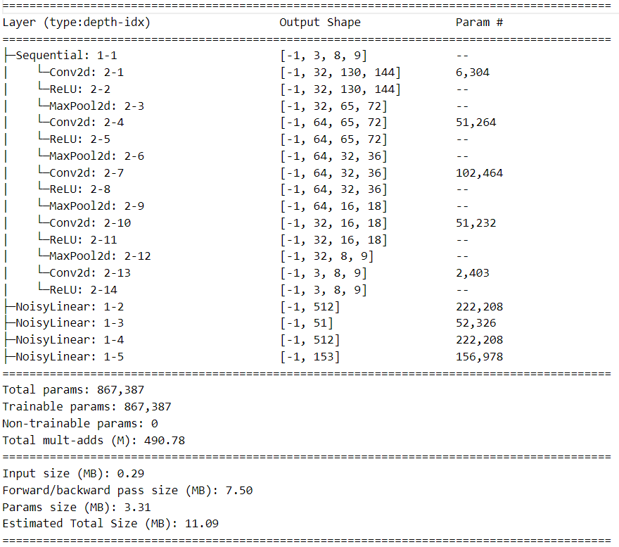

# Atari-Skiing-Using-Rainbow-DQN
Author: [Ng Zheng Jue](https://github.com/xinjue37), [Ng Rui Qi](https://github.com/Ruiqi2002), [Ong Ming Jie](https://github.com/ethanong98), [Tan Hong Guan](https://github.com/tanhg1116)

* This is a project developed in undergraduate Year 3 - Semester 2
* This repository consists of solving a control movement problem using Deep Reinforcement Learning. The deep learning architecture used is Rainbow DQN (Deep Q network) as we are dealing with the deterministic action
* At the same time, we analyze the effect of applying imitation learning in the Atari Skiing problem, the demonstration can be shown at [youtube](https://youtu.be/9t5emH0xPSo)
* This repository consists of
  * 1 Jupyter Notebook file [skiing.ipynb](https://github.com/xinjue37/Undergraduate-Y3S2-Atari-Skiing-Using-Deep-Q-Network-Rainbow/blob/main/skiing.ipynb) that consists of overall experimental design, development of method including training and evaluating the deep learning model and lastly the overall conclusion of the result obtained.
  * 3 python file ([model.py](https://github.com/xinjue37/Undergraduate-Y3S2-Atari-Skiing-Using-Deep-Q-Network-Rainbow/blob/main/model.py), [memory.py](https://github.com/xinjue37/Undergraduate-Y3S2-Atari-Skiing-Using-Deep-Q-Network-Rainbow/blob/main/memory.py), [agent.py](https://github.com/xinjue37/Undergraduate-Y3S2-Atari-Skiing-Using-Deep-Q-Network-Rainbow/blob/main/agent.py))
  * [Image](https://github.com/xinjue37/Undergraduate-Y3S2-Atari-Skiing-Using-Deep-Q-Network-Rainbow/blob/main/Image) folder to store image for the jupyter notebook file
  * To run the code, install all the require library in the [install_package.txt](https://github.com/xinjue37/Undergraduate-Y3S2-Atari-Skiing-Using-Deep-Q-Network-Rainbow/blob/main/install_package.txt)
 
## Introduction
In this experiment, we delve into the application of RL to the challenging Gym Skiing Atari environment, seeking to formulate the RL problem and design experiments to gauge the learning capabilities of a Deep Q-Network (DQN) model with __imitation learning__ by using the episode generated by heuristic agent to train the DQN. 

The formulation of the RL problem involves defining the state space, action space, and reward structure to guide the learning process effectively. The state, action and reward of the Skiing Environment is as follows:
* The state at each step, $s_t$ is represented as a cropped gray scale image with shape = (130, 144). To let the DQN model have the previous state information, continuous 4 states with shape (4,130,144) is passed to the DQN model to obtain the action.

* The agent has 3 possible actions and it can perform 1 action at each step, $a_t$. Since the action is discrete, the selection for DNN will be DQN as only single forward pass is needed to obtain an action. The action value and its corresponding meaning is as follows:

| Value | Meaning |
|:-:|:-:|
| 0     | NOOP    |
| 1     | RIGHT   |
| 2     | LEFT    |

* The reward is always -1 if the agent does not reach the goal state, and ~ -450 penalty given at the end of the game if the agent does not pass a flag in the game. In the game, there is total of 20 pair of flags. For example, if the agent does not pass 10 pairs of flag in an episode, -4500 penalty will only be given at the end of the game

## Experiment Design
* The selection of the Deep Learning Model will be the Rainbow DQN, which follows the implementation in the [Github](https://github.com/Kaixhin/Rainbow). For the Rainbow DQN, it implemented 6 improvements from the original Deep Q-learning:

    |No|Improvement|Description|Benifits|
    |:-:|:--|:--|:--|
    |1|Double Q-learning|Use current Q to select action and old Q to evaluate the action|To solve the maximization bias problem|
    |2|Prioritized Experienced Replay|Reorder the order of the sample to update Q |To increase the training speed|
    |3|Dueling Networks|Output Advantage function and value function to form the final Q value|To help quickly identify good action|
    |4|Multi-step learning|Use multiple step rewards to update the Q value in Deep neural network|To solve the problem where some individual actions do not have immediate reward|
    |5|Distribution RL|Instead of outputting Q, output distribution of return (mean and std) |To yield better results in the noisy and stochastic environment|
    |6|Noisy Exploration Layer|Add some random noise to the Linear Layer |To favor more exploration|

* The neural network architecture used is as followed:

    

* Secondly, to facilitate faster training speed of Rainbow DQN, a __Heuristic Agent__ that does not have the optimal action, but can pass all the flags in each games is built to guide the training of the Rainbow DQN. The pseudocode of sampling an episode for training is as follows, with 80% probability that the action is sampled by the heuristic agent, 10% probability for a random policy to facilitate exploration, and 10% based on the action of DQN to facilitate exploitation. The policy used to select actions from DQN is based on the softmax policy.
```
if rand_value < 0.8:   # Sample action from heuristic agent
    action = heuristic_agent.get_action(raw_obs)
elif rand_value < 0.9: # Sample action from DQN
    action          = dqn.act(state)[0] # Choose an action greedily (with noisy weights)         
else:                  # Sample action from random policy
    action = random.randint(0,2)
```
* At each 50000 steps of training, a checkpoint will be saved for further analysis. After sufficient training, 5 models with difference stages are chosen to investigate the effectiveness of the learning process. The key metrics considered for evaluation of effectiveness are the __average number of time steps taken to finish a game for n episodes__, and the __average accumulated rewards achieved for n episodes__. In our case, n is set to be 10.
